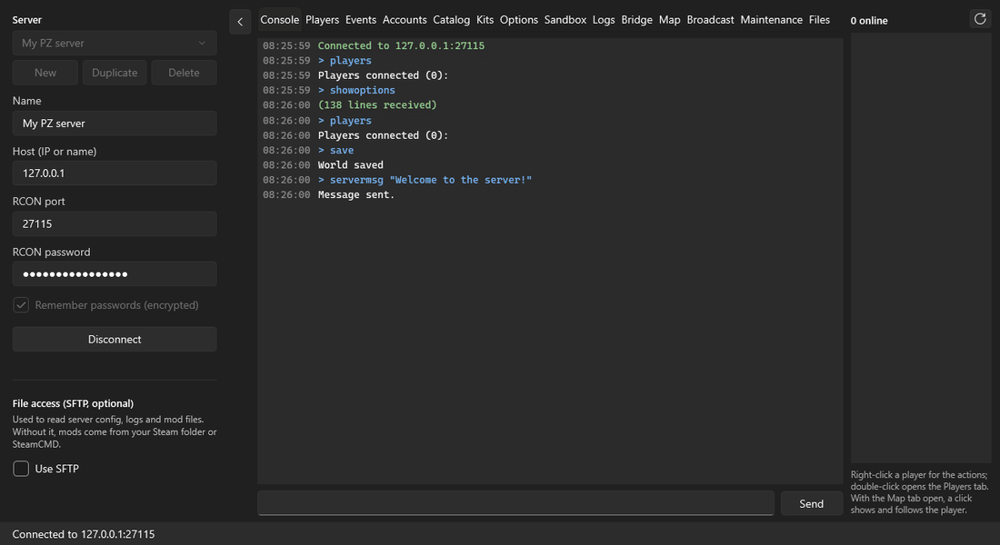

# SpiffoCON

[](https://github.com/FirekeeperPhate/SpiffoCON/releases/latest)
[](https://github.com/FirekeeperPhate/SpiffoCON/releases)
[](LICENSE)

Remote admin console for Project Zomboid (Build 42) dedicated servers, over RCON.
Windows, .NET 10, WPF.

**[Download the latest version](https://github.com/FirekeeperPhate/SpiffoCON/releases/latest)**
(then SpiffoCON updates itself: see [Updates](#updates)).



*The tabs against a B42 test server (players, positions, chat, inventory and mod updates are sample data).*

## Getting started

1. Download the installer from the
   [latest release](https://github.com/FirekeeperPhate/SpiffoCON/releases/latest): **Full**
   includes the .NET runtime, **Light** needs the
   [.NET 10 Desktop Runtime](https://dotnet.microsoft.com/download/dotnet/10.0) (x64).
2. On the left, enter the server's host, RCON port and RCON password (the server's `RCONPort` and
   `RCONPassword` options; your host's panel shows them), then **Connect**.
3. Optional, for logs, accounts, sandbox settings, mod files, the map and the bridge: tick
   **Use SFTP** and enter the SFTP user and password your host gives you.
4. Optional, for player positions, inventories, vehicles, heal and weather: add the
   [SpiffoCON Bridge](#the-bridge-mod) mod to the server. You don't have to publish anything: use
   the Workshop item below.

## Updates

Once a day SpiffoCON asks GitHub for the latest release (only its version number is sent). When
there is a newer one it shows what is new, with **Install and restart** (the installer of the same
edition, Full or Light, is downloaded, checked against GitHub's SHA-256, and run quietly; servers,
passwords and settings are kept, and SpiffoCON opens again), **Skip this version** or **Later**.
**Check for updates**, in the status bar's corner, looks right away from any tab; the Maintenance
tab turns the daily check off. A copy that wasn't installed by
the installer (a build, a copied folder) doesn't check by itself, and opens the releases page
instead.

## Features

- RCON client written for PZ: replies matched by request id (a late reply is never shown
  for the next command), long replies in one or several packets, automatic reconnect
  before the next command after a drop, UTF-8.
- Console with history (Up/Down); a leading `/` is stripped.
- Broadcast editor for `servermsg`: colors (`<RGB:r,g,b>`), multi-line (`<LINE>`),
  live preview, safe quoting (inner `"` become `'`), and a reply check that does not
  report a delivered message as failed.
- Catalog of items and vehicles, **mods included**: search, filter by kind and by mod,
  mod item icons, give items (`additem`) and spawn vehicles (`addvehicle`) for an online
  player.
  - The base game comes from a bundled snapshot (`src/SpiffoCON.Core/Data`), so no game
    install is needed.
  - The server's mods come from `showoptions` (`Mods=`, `WorkshopItems=`), in its load
    order. Mod files are read from, in this order: the server over SFTP (only scripts,
    English translations and icons, only from the folders the game loads, over 4 parallel
    connections, one copy per server; mods unchanged since the last copy are skipped,
    according to the server's `appworkshop_108600.acf`, and without it every mod is checked
    again), the local Steam workshop folder, SteamCMD
    (anonymous download of whole mods, asked first, cached in
    `%LOCALAPPDATA%\SpiffoCON`).
  - Base-game icons: **Game icons…** reads the `Item_*` sprites from the texture packs
    (`media/texturepacks/*.pack`) of your own Project Zomboid install into SpiffoCON's cache.
    The dedicated server has no textures, and the game's art is not shipped with SpiffoCON.
  - B42 layout (`common` + the newest `42.x` folder), JSON and legacy translation files,
    vehicle names through `carModelName` / `template!`, mods that change base-game items.
- Players tab: online list (auto refresh), kick and ban (with reason, optional IP ban),
  unban, voice mute, access level, teleport to a player or to coordinates, god mode,
  invisibility, no clip, XP per skill. Command syntax comes from the B42 server's
  `@CommandArgs` annotations, and replies were checked against a real B42 dedicated
  server (access levels are the lowercase B42 roles: user, priority, observer, gm,
  moderator, admin).
- Events tab: rain with intensity (1-100), optionally stopped by SpiffoCON after a number of
  minutes (the server has no rain duration), thunderstorms lasting a number of game hours,
  stop rain / stop all weather; lightning, thunder or a zombie horde on a random online
  player, on every online player or on one player; helicopter and gunshot events (the server
  picks the player for these two), and a button to call the helicopter off. Every reply is
  checked and listed. Syntax and replies checked on a real B42 server.
  Weather (bridge v5): fog, clouds, wind, temperature and snowfall set to a value, as the
  game's own admin Climate panel does; the server sends it to the players at its next climate
  update (within ten game minutes). The game keeps the settings with the world until *Back to the
  game's weather*.
- Kits tab: sets of items (starter kit, event prizes) built from the catalog ("Add to kit"),
  shared by all your servers, given in one go to a player or to every online player.
- Maintenance tab:
  - Mod updates: the server's installed copies (its `appworkshop_108600.acf`, over SFTP)
    against Steam, mod by mod: newer on Steam, not installed yet, up to date, or not public;
    each row opens its Workshop page in the browser.
  - Restart with a countdown: warnings in chat as the time runs out (message and color
    editable, `{time}` filled in), then `save` and `quit`; starting the server again is up to
    the host. SpiffoCON tells you when it answers again. **Restart now** skips the countdown: one
    line in chat if anyone is online, then `save` and `quit` (asks first).
  - Desktop notifications (tray icon): players joining and leaving, chat messages containing
    chosen words (from the Logs tab while it follows the chat log), connection lost and back;
    by default only while SpiffoCON is in the background.
- Options tab: all 144 server options grouped like the game's settings screen, with
  descriptions, defaults and ranges (dumped from a real B42 server by
  `tools/DumpServerOptions.lua`, built by `tools/MakeServerOptions.cs`). Values are
  validated before `changeoption` and each reply is checked, since the server silently
  keeps the old value on bad input. ResetID, ServerPlayerID and Seed have no default and
  ask before changing.
- Sandbox tab: the 269 sandbox options, edited in the server's `<name>_SandboxVars.lua`
  over SFTP or in a local copy. Only the changed values are rewritten (comments, order,
  line endings and unknown mod settings stay), a backup is kept, and the server applies
  the file at its next start (checked on a real B42 server, also on an existing world).
- Logs tab: follows the server's Zomboid/Logs over SFTP (or a local folder) every 5 s:
  player chat (which RCON can't see), broadcasts, joins, admin actions and any other log
  the server writes. Switches to the new files by itself when the server restarts, and has
  a quick broadcast box.
- Accounts tab: every account the server knows, online or not, from a copy of its SQLite
  databases read over SFTP (or a local Zomboid folder): role (banned included), last login,
  character name, last saved position, dead or alive, and the kick/ban history with reasons.
  Password hashes are never read. Ban, unban and "To Players tab" (with the last position)
  go through RCON.
- Bridge tab, with the **SpiffoCON Bridge** mod (`bridge/SpiffoCONBridge`, B42, server
  side only): player positions, health, role, vehicle and inventory, vehicles in loaded
  areas and world state, which RCON can't give. It talks through files in the server's
  `Zomboid/Lua` folder, read and written over SFTP (`spiffocon_in.txt` /
  `spiffocon_out.txt`). Bridge v2 adds admin actions, each done the way the game's own
  server code does it (with its client sync) and written to the admin log: full heal,
  remove items (not worn or attached ones; bridge v3 removes them from the container they
  are listed under), repair, refuel or remove a vehicle, all asked for confirmation. Bridge v5
  sets the weather (Events tab). Bridge v6 removes the zombie corpses within a radius of a spot
  on the map or of a player, on every floor (those of players and animals stay), as the debug
  Horde Manager's *Remove bodies* does. Bridge v7 adds:
  - more to clean up within a radius: items lying on the ground (counted first, then asked;
    furniture, containers and safehouses are not touched) and fires;
  - the safehouses, drawn on the map with their owner, and removing one (what is in it stays);
  - a player's sheet next to the inventory: profession, traits, skills, and what is wrong
    with them (infection, bites, hunger, panic...);
  - the zombies near each player, in the sidebar and in the players list;
  - the time of day (Events tab): the clock skips forward to the next time it is that hour,
    the only way the game's clock goes, and the world ages by the hours skipped;
  - a key of a vehicle for the selected player;
  - two bags of the same type in one inventory told apart ("School Bag #2").

  The bridge runs while the server runs a game: an empty server with `PauseEmpty=true` is
  paused and the bridge waits; SpiffoCON connects to it by itself when someone joins.
- Map tab: the game's world map (drawn like the in-game map from the game's own
  `worldmap.xml` and forest images, with building types in color and place names, or the
  game's top-down satellite view) with the players and vehicles the bridge reports, updated at
  each bridge refresh (every 15 s). Wheel zooms, dragging moves, clicking a player (on the map,
  or in the sidebar while the Map tab is open) selects and can follow them; right-click teleports
  the selected player there, copies the coordinates, spawns a horde there (`createhorde2`, number
  and radius set in the toolbar), removes the zombies around (`removezombies`) or their corpses
  (through the bridge). The server
  places zombies only where the map is loaded, that is near a player, and says "invalid
  location" elsewhere. The map files are read from a Project Zomboid or dedicated server install
  on this PC, or copied once from the server over SFTP (about 17 MB, 50 MB more for the satellite
  view) into `%LOCALAPPDATA%\SpiffoCON`. Maps added by mods (the server's `Map=`) are drawn too,
  merged the game's way (the first map in `Map=` with data in a cell draws that cell); their
  map files come from the workshop folders on this PC (Steam, SpiffoCON's SteamCMD) or are
  copied from the server over SFTP (only `worldmap.xml`, `worldmap-forest.xml` and the place
  names: a few hundred KB). Mods without a `worldmap.xml` show nothing, as in the game.
- Online players sidebar on the right, always in view (refreshed every 30 s), with each player's
  position when the bridge is connected; double-click opens the player in the Players tab.
- Player menu: right-click a player wherever players are listed (the sidebar, Players, map
  markers, Bridge, Accounts, chat lines in Logs): show in the Players tab, on the map or their
  inventory, teleport to another player or bring one here, give a kit, lightning / thunder /
  horde, full heal (bridge), god mode, invisible, no clip, access level, voice mute, kick, ban,
  unban, copy the name. Each reply shows in the status bar.
- SFTP probe (optional): looks for `Server/*.ini`, workshop folders
  (`content/108600`), `Zomboid/mods` and logs. The SSH host key is saved at the first
  connection and checked afterwards. With SFTP on, connecting also connects the bridge,
  follows the logs and loads the server's mods into the Catalog over SFTP (never with SteamCMD:
  that stays with Load from server, which asks); a box in the SFTP settings turns it off.
- The connection panel hides by itself once connected (the arrow at the top left brings it back
  or hides it again) and is always shown while not connected.
- Server list: save several servers (name, RCON, SFTP and the folders found on each), add,
  duplicate or delete them, and switch while disconnected; every tab starts clean for the
  new server. The list lives in `%APPDATA%\SpiffoCON\servers.json` (the single
  `profile.json` of 0.9.2 and earlier is imported once); passwords are encrypted with DPAPI
  (current Windows user).

## Build

```
dotnet build SpiffoCON.slnx
dotnet test tests/SpiffoCON.Core.Tests
```

`src/SpiffoCON.Core` holds everything that is not UI (RCON, commands, SFTP, catalog,
Steam) and targets plain `net10.0`.

To refresh the base-game catalog after a game update, download the free dedicated
server (`steamcmd +login anonymous +app_update 380870 +quit`) and run:

```
dotnet run tools/MakeVanillaSnapshot.cs -- "<dedicated server folder>"
```

## The bridge mod

### Using it

The bridge is published on the Steam Workshop:
[SpiffoCON Bridge](https://steamcommunity.com/sharedfiles/filedetails/?id=3809683986), Workshop id
`3809683986`, mod id `SpiffoCONBridge`. Any server can use it; nothing needs to be uploaded.
The item is unlisted, so it doesn't show in searches nor in hosts' mod browsers: add it by hand.

1. On the server, add `SpiffoCONBridge` to `Mods=` and `3809683986` to `WorkshopItems=` (the
   Bridge tab's **Copy server settings** puts both on the clipboard; the Options tab edits these
   lists), then restart the server so it downloads the mod.
2. In SpiffoCON, with SFTP set, the bridge connects by itself when you connect (or press **Find
   on server** in the Bridge tab).

It runs on the server only: players don't need it, and it does nothing on their game. It acts only
on requests SpiffoCON writes into the server's `Zomboid/Lua` folder, so only someone who can
already write the server's files can use it. SpiffoCON checks the bridge version and greys out
what an older bridge can't do.

### Publishing it (maintainer)

`bridge/SpiffoCONBridge/workshop.txt` keeps the Workshop id, so new uploads update the same item.
To upload an update:

1. In SpiffoCON's Bridge tab press **Prepare Workshop upload**: it copies
   `bridge/SpiffoCONBridge` to `%USERPROFILE%\Zomboid\Workshop\SpiffoCONBridge`.
2. Start Project Zomboid, open **Workshop** from the main menu, pick SpiffoCON Bridge and
   upload it (`workshop.txt` sets it unlisted).
3. Servers get the new version at their next restart.

A fork that wants its own Workshop item removes the `id=` line from `workshop.txt` (Steam refuses
an upload to someone else's item; the game writes the new id there after the first upload) and
changes `BridgeMod.PublishedWorkshopId` in `src/SpiffoCON.Core/Bridge/BridgeMod.cs`, which
**Copy server settings** uses. `tools/MakeBridgeImages.cs` redraws `preview.png` and `poster.png`.

## Installers

```
powershell -ExecutionPolicy Bypass -File installer\build.ps1
```

runs the tests, publishes `publish\light` (framework-dependent, needs the .NET 10 Desktop
Runtime) and `publish\full` (self-contained), and builds with Inno Setup
`installer\Output\SpiffoCON-Setup-<version>-Light.exe` / `-Full.exe`. The version comes from
`<Version>` in `src\SpiffoCON\SpiffoCON.csproj`. Installs per user by default (all users can
be chosen); Light and Full replace each other. User data (`%APPDATA%\SpiffoCON`,
`%LOCALAPPDATA%\SpiffoCON`) is never touched by setup or uninstall.
`tools/MakeAppIcon.cs` redraws `src/SpiffoCON/Assets/spiffocon.ico`.

## License

MIT, see [LICENSE](LICENSE). Project Zomboid, its art and its text belong to The Indie Stone;
SpiffoCON is not affiliated with them. SpiffoCON ships none of the game's art: item icons are read
from your own game install, and the map from the game's files on your PC or on your server. It
does ship three text files made from the game's files by the tools in `tools/`, so it works
without a game install: the base-game item list of the Catalog (item ids, names, categories;
`src/SpiffoCON.Core/Data/vanilla-catalog.json.gz`) and the server and sandbox options with their
defaults, ranges and descriptions (`server-options.json`, `sandbox-options.json`).
